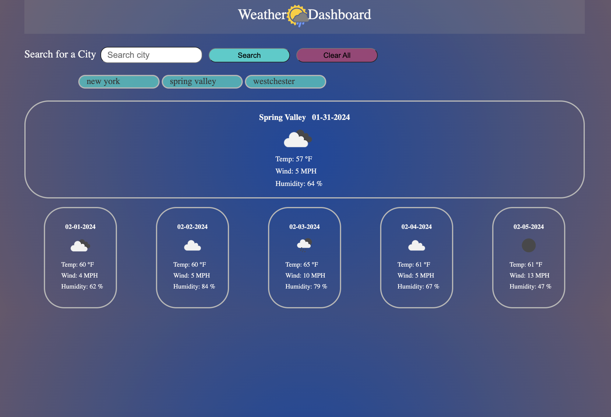

# rafa-weather-dashboard

## Description

The goal of the project is to use the Open Weather API and display weather related information. When the user enters the location name, weather information such as weahter icon, temp, wind speed, and humidity are displayed. The entered location is saved and displayed on the page, allowing the user to click it and easily access weather data. A clear all button is available to clear all saved locations.

## Link to webpage
https://rafarizvi.github.io/rafa-weather-dashboard/

## Installation

N/A

## Usage

This is a weather dashboard website. It allows users to type a location name and displays the current weather and a five-day forcast. Searched locations are saved, but can be cleared if necessary.

## Credits

Open Weather - APIs
Link: https://openweathermap.org/

## License

This project uses the MIT license.

## Badges

## Features

- Displays current weather and 5-day forcast.
- Allows users to type in a location and displays info.
- Information such as weather icon, temp, wind speed, and humidity can be viewed.
- saves location history and displays on page.
- saved locations can be clicked to access location weather easily.
- saved locations can be cleared by clicking a button.

